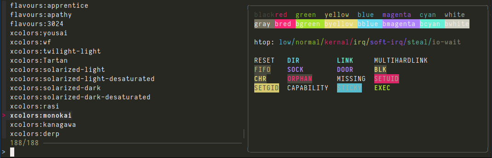

# dynamic-colors

This is a small tool for changing per-terminal window/tab colors on the fly. Switching an entire [tmux](http://tmux.sourceforge.net/) session between [Solarized](http://ethanschoonover.com/solarized) dark and light modes is possible from a <kbd>alt+L</kbd> hotkey.

I use it to help distinguish ssh-connected hosts and project specific terminals.

`dynamic-colors` pulls from user defined color schemes or can tap into [`flavours`](https://github.com/Misterio77/flavours) for more predefined color schemes. In either case, schemes are set only on a single terminal window unlike `flavours` or [`wal`](https://github.com/dylanaraps/pywal) where colors are applied system-wide.




## Usage

After setting up (see [Prerequisites](#Prerequisites)), use `dynamic-colors fuzzyall` (or <kbd>Alt+l </kbd>) to list and select colorschemes. <kbd>ctrl+j</kbd> will apply the theme without exiting. The right side preview is `dynamic-colors show`: named colors, `htop` i/o colors, and `dircolors`.

## Color Schemes

There are two sources of colors:
  1. `color0` to `color15` shell definitions converted from [`.Xresource`](http://en.wikipedia.org/wiki/X_resources) style in the [`colorschemes/`](colorschemes/) directory. (see [xcolors](https://github.com/tlatsas/xcolors) and https://terminal.sexy/ "window"->"scheme browser")
  2. `base00` to `base0F` as downloaded by `flavours update all`

Both are accessible from `dynamic-colors fuzzyall` (screenshot above), `dynamic-colors listall`, and `dynamic-colors switchall`.

`dynamic-colors` options `list`, `fzf`,`switch`, `cycle` use the first xresource like colors whereas options `flavour`, `fuzzyflavours`, and `flavourrandom` use the latter.


## Prerequisites

Your terminal must support the appropriate OSC escape sequences [ANSI escape code](https://en.wikipedia.org/wiki/ANSI_escape_code). xterm and urxvt (rxvt-unicode) work fine.

Make sure `dynamicColors` is enabled in `.Xdefaults`/`.Xresources`

    xterm*dynamicColors: true
    urxvt*dynamicColors: on

### Compatibility Check

This changes your terminal background color to red if your terminal supports OCS:

    echo -e "\033]11;#ff0000\007"

### flavours

[`flavours`](https://github.com/Misterio77/flavours) is available as a rust create. Get it from your package manager, `cargo install flavours`, or directly from [the release page](https://github.com/Misterio77/flavours/releases). If your downloading the binary from github, I recommend extracting to the bin directory of this repo to keep colorscheme tools in one place and need only one additional folder added to your `PATH`.

Be sure to run `flavours update all` to fetch the default set of colorschemes.

### fzf

`dynamic-colors` uses [`fzf`](https://github.com/junegunn/fzf/) for fuzzy selection and color preview. It is not necessary, but enhances discoverability and improves the ergonomics of exploring colorschemes.

## Setup

1. Clone the repository into `~/.dynamic-colors`:

        git clone https://github.com/WillForan/dynamic-colors ~/.dynamic-colors

2. To add the tool to your `PATH` put the following line in your profile (`.bashrc`/`.zshrc`/`.profile`).

        export PATH="$HOME/.dynamic-colors/bin:$PATH"

3. For autocompletion add this to your profile (`.bashrc`/`.zshrc`/`.profile`). Change .zsh to .bash for bash environments.

        source $HOME/.dynamic-colors/completions/dynamic-colors.zsh

4. To change with a keybinding, in `.bashrc` add

        bind -x '"\el":"dynamic-colors fuzzyall"'    # Alt + l = pick theme with fzf
        bind -x '"\e\C-l":"dynamic-colors cycle"'    # Ctrl+Alt+L = cycle

5. See [xcolors](https://github.com/tlatsas/xcolors) and https://terminal.sexy/ ("window"->"scheme browser"; export "Termine" + `s/ *=* /=/g`) for colorschemes
6. And/or `flavours update all` to fetch a large number of base16 themes.

## Usage

Pick a scheme with `fzf`:
    dynamic-colors fzf

List available color schemes:

    dynamic-colors list

Switch to a color scheme:

    dynamic-colors switch solarized-dark

Reload last color scheme:

    dynamic-colors init

Add this line to your profile to always set the last color scheme.

### Integration

I'm using the provided color schemes in conjunction with [dircolors-solarized](https://github.com/seebi/dircolors-solarized) and [vim-colors-solarized](https://github.com/altercation/vim-colors-solarized) for best results. Always use the dark mode and switch schemes with `dynamic-colors switch <colorscheme>`


## Developing color schemes

Create a new color scheme (will be opened in your default editor):

    dynamic-colors create my-color-scheme

Edit an exising color scheme:

    dynamic-colors edit my-color-scheme

Check if all colors are defined:

    dynamic-colors audit my-color-scheme

## Key binding 
### example for bash
```
 bind -x '"\el":"dynamic-colors cycle"'
```
### example for zsh
```
dyncolor() dynamic-colors cycle
zle -N dyncolor
bindkey '\el' dyncolor

```

### example for urxvt
Save this to a file named "urxvt-colors":

    sub on_user_command {
        my ($self, $cmd) = @_;
        my $output = `dynamic-colors cycle`;
        $self->cmd_parse($output);
    }

Add this to ~/.Xdefaults:

    urxvt*perl-ext-common: urxvt-colors
    urxvt*perl-lib: [directoy of urxvt-colors]
    urxvt*keysym.F12: perl:urxvt-colors:

Now you can cycle through all color schemes using F12 for example,
without closing running console applications.

